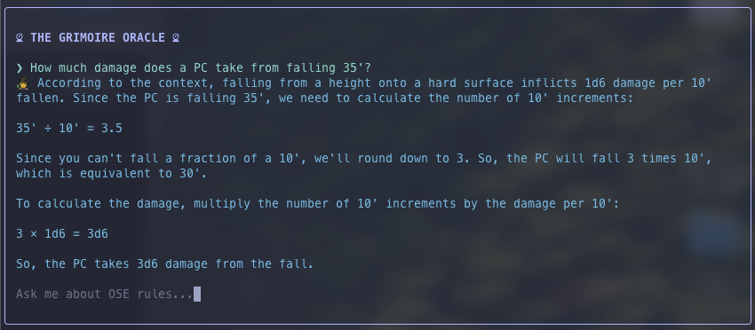

# The Grimoire Oracle

An AI-powered rules assistant for Old School Essentials (OSE) that runs entirely on your local machine. Ask questions about spells, equipment, classes, combat, or any other OSE rule in plain English — no internet connection or API keys required.

Built with LangChain, Ollama, and a React/Ink terminal UI.



## Features

- **Conversational Q&A** — Ask follow-up questions naturally; the Oracle remembers context from earlier in the conversation
- **Hybrid search** — Combines semantic vector search with BM25 keyword matching for more accurate rule retrieval
- **Fully local** — All inference runs via Ollama; your queries never leave your machine
- **OSE rules built-in** — Covers characters, classes, equipment, magic, spells, vehicles, retainers, and more

---

## Prerequisites

- **Node.js** 18+
- **Ollama** — install from [ollama.com](https://ollama.com/), then launch the app at least once so the CLI tools are available

---

## Setup

### 1. Install Ollama models

Pull the required models (this only needs to be done once):

```bash
./scripts/setup.sh
```

This installs:

- `llama3` — the LLM used for answering questions
- `nomic-embed-text` — the embedding model used for semantic search

### 2. Install dependencies

```bash
npm install
```

### 3. Build the vector index

```bash
npm run ingest
```

This reads all the markdown rule files in `vault/` and creates a searchable vector index at `grimoire_index/`. Run this once after cloning, or again if you modify files in `vault/`.

### 4. Launch the Oracle

```bash
npm run dev
```

---

## Usage

Type your question at the prompt and press Enter. The Oracle will search the OSE rules and respond with a grounded answer.

```
You: How does initiative work?
You: What spells can a 3rd-level magic-user cast?
You: What's the cost of plate armor?
You: What about chain mail? (follow-up questions work too)
```

If the rules don't contain the answer, the Oracle will say so rather than making something up.

Press `Ctrl+C` to exit.

---

## Project Structure

```
vault/          OSE rules as markdown files (the knowledge base)
scripts/
  ingest.ts     Builds the vector index from vault/
  setup.sh      Pulls required Ollama models
src/
  oracle-logic.ts  LangChain RAG pipeline
  App.tsx          Terminal UI (React/Ink)
grimoire_index/ Generated vector store (created by ingest)
```

---

## How It Works

The Oracle uses a **Retrieval Augmented Generation (RAG)** pipeline:

1. Your question is rephrased using chat history to form a precise search query
2. A hybrid retriever (vector search + BM25 keyword search) finds the most relevant rule chunks from the vault
3. Those chunks are passed as context to the LLM, which generates a grounded answer

This means answers are always based on the actual OSE rules — not the model's training data.

---

## OSE Data

Rule content sourced from [Old School Essentials Markdown](https://github.com/Obsidian-TTRPG-Community/Old-School-Essentials-Markdown).
